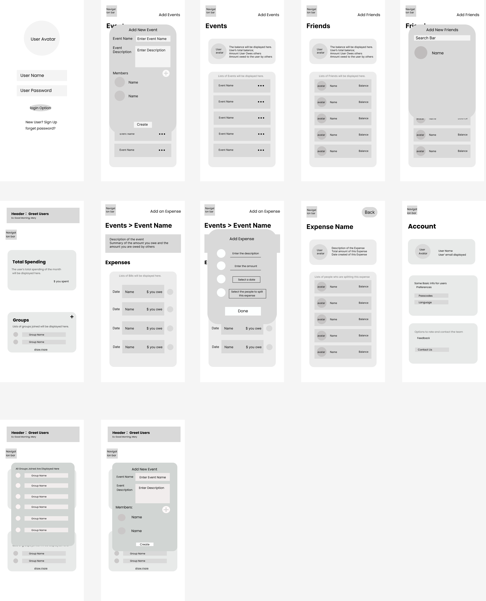

# User Experience Design

<!--  -->

## App Map

## Wireframe

### User Login and Sign Up Page

- This is where the user can login or sign up.

### Events Page With Add Events Pop Up

- This is where the user can add a new event and add people to this event.

### All Events Page

- This is where the user can see a list of all their events as well as their current balance. The balance will also include how much the user owes and how much is owed to them.

### Friends Page

- This is where the user can see a list of all their friends.

### Friends with Add Friend Pop Up

- The user will be able to add new friends here.

### Home Page

- The user will be able to see their monthly total spending and a list of their joined groups here.

### Specific Event

- The user will be able to see a description for their event and a list of their expenses for this specific event.

### Specific Event with Pop Up Window

- The user will be able to add new expenses here.

### Expense Page

- The user will be able to see a list of people who are splitting this expense

### Account Page

- User's basic information will be displayed here. You will also have options to rate and contact the team.

### Home Page with Show More Pop Up

- If you click show more in the groups section, it will display all the groups.

###

